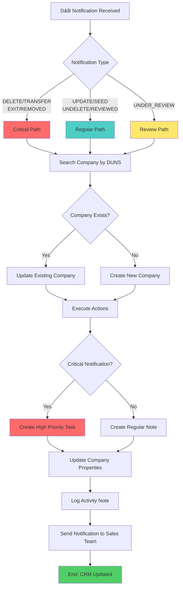

# TraceOne D&B → HubSpot Integration Workflow

## 📊 Visual Process Flow



## 🎯 Notification Type → Action Matrix

| D&B Event | Impact Level | HubSpot Task | HubSpot Note | Property Update | Sales Alert |
|-----------|--------------|--------------|--------------|----------------|-------------|
| **DELETE** | 🔴 Critical | ✅ High Priority | ✅ Detailed | ✅ Critical Flag | ✅ Immediate |
| **TRANSFER** | 🔴 Critical | ✅ High Priority | ✅ Detailed | ✅ Critical Flag | ✅ Immediate |
| **EXIT** | 🔴 Critical | ✅ High Priority | ✅ Detailed | ✅ Critical Flag | ✅ Immediate |
| **REMOVED** | 🔴 Critical | ✅ High Priority | ✅ Detailed | ✅ Critical Flag | ✅ Immediate |
| **UNDER_REVIEW** | 🟡 Medium | ✅ Medium Priority | ✅ Detailed | ✅ Review Flag | ✅ Standard |
| **UPDATE** | 🟢 Low | ❌ | ✅ Summary | ✅ Last Update | ❌ |
| **SEED** | 🟢 Low | ❌ | ✅ New Company | ✅ Company Info | ❌ |
| **UNDELETE** | 🟡 Medium | ❌ | ✅ Reactivation | ✅ Status Update | ❌ |
| **REVIEWED** | 🟢 Low | ❌ | ✅ Completion | ✅ Review Done | ❌ |

## 🏗️ HubSpot Object Creation

### Company Record
```
📋 Company: "Acme Corporation"
├── 🏷️ DUNS Number: 123456789
├── 🌐 Website: www.acme.com
├── 📞 Phone: +1-555-123-4567
├── 🏢 Address: [From D&B Data]
├── 📊 Lifecycle Stage: Lead
├── 🎯 Lead Source: TraceOne D&B Monitoring
├── ⏰ Last D&B Update: 2025-09-26 10:30:00
├── 🚨 Critical Alert: Yes/No
└── 📝 D&B Alert Type: DELETE/UPDATE/etc
```

### Task Record (Critical Alerts)
```
📋 Task: "D&B Alert: DELETE - DUNS 123456789"
├── 🎯 Priority: HIGH
├── 👤 Owner: Sales Rep / Default Owner
├── 📅 Due Date: Today + 1 day
├── 🏢 Associated Company: Acme Corporation
├── 📝 Description: 
│   ┌─ D&B Monitoring Alert: DELETE
│   ├─ DUNS: 123456789
│   ├─ Timestamp: 2025-09-26 10:30:00
│   ├─ ⚠️ CRITICAL ALERT - Immediate attention required
│   ├─ Changes detected:
│   │   └─ organization.status: active → deleted
│   └─ Source: TraceOne D&B Monitoring System
└── 🔗 Related Objects: Company, Notes
```

### Activity Note
```
📋 Note: "D&B UPDATE Notification"
├── ⏰ Timestamp: 2025-09-26 10:30:00
├── 🏢 Associated Company: Acme Corporation
├── 👤 Created By: TraceOne System
├── 📝 Content:
│   ┌─ D&B Monitoring Alert: UPDATE
│   ├─ DUNS: 123456789
│   ├─ Timestamp: 2025-09-26 10:30:00
│   ├─ Changes detected:
│   │   ├─ 1. organization.primaryName
│   │   │   ├─ Previous: Old Company Name
│   │   │   └─ Current: Acme Corporation
│   │   └─ 2. organization.telephone
│   │       ├─ Previous: 555-0123
│   │       └─ Current: 555-0124
│   ├─ Notification ID: [UUID]
│   └─ Source: TraceOne D&B Monitoring System
└── 🏷️ Type: D&B Notification
```

## ⚡ Real-Time Processing Timeline

```
🕐 T+0s    D&B sends notification to TraceOne
🕐 T+1s    TraceOne processes and validates notification
🕐 T+2s    HubSpot integration searches for existing company
🕐 T+3s    Company found/created in HubSpot
🕐 T+4s    Task/Note objects created
🕐 T+5s    Company properties updated
🕐 T+6s    Sales team notification sent
🕐 T+7s    Process complete ✅
```

## 📱 Sales Team Experience

### In HubSpot Dashboard
1. **Task Queue**: New high-priority D&B tasks appear
2. **Company Timeline**: Activity notes show change history
3. **Property Updates**: Critical alert flags visible
4. **Notifications**: Email/mobile alerts for urgent tasks

### Task Management
- **Filter by Source**: "TraceOne D&B Monitoring"
- **Priority Sorting**: Critical alerts appear first
- **Quick Actions**: Call, email, create deal
- **Status Updates**: Mark tasks complete when addressed

## 🎛️ Configuration Options

### Per Notification Type
```yaml
DELETE:
  task_priority: HIGH
  task_due_days: 1
  notify_immediately: true
  create_deal: false
  
UPDATE:
  task_priority: null  # No task created
  notify_immediately: false
  update_company_data: true
```

### Per Sales Team/Region
```yaml
task_assignments:
  enterprise: "enterprise-sales@company.com"
  smb: "smb-sales@company.com"
  default: "sales-manager@company.com"
```

### Custom Properties
```yaml
property_mappings:
  duns_field: "custom_duns_number"
  alert_date: "last_dnb_alert"
  critical_flag: "dnb_critical_alert"
  monitoring_status: "dnb_monitoring_active"
```

---

*This diagram illustrates the complete end-to-end process from D&B notification to HubSpot CRM action, ensuring stakeholders understand the technical flow and business impact.*
